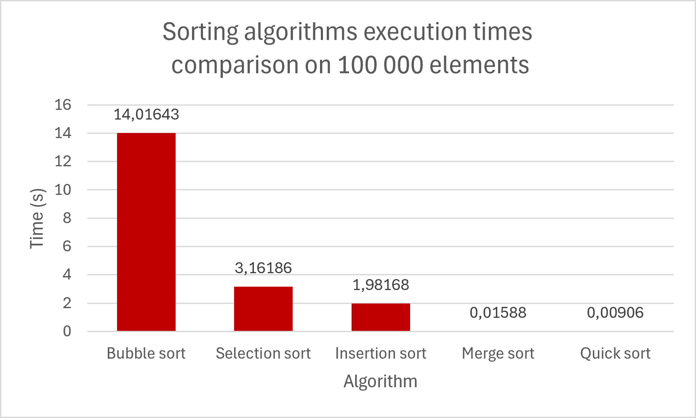

# Sorting-Algorithms

A Java-based performance benchmark comparing 5 classic sorting algorithms. The project measures execution times
across multiple runs using randomly generated arrays.

## Benchmark Results

Here are the average execution times obtained on **5 runs** with random arrays of **100,000 elements**:

| Algorithm | Average Time (s) | Complexity (Average) | Space Complexity |
| :--- | :---: | :---: | :---: |
| **Bubble Sort** | `14.016 s` | $O(n^2)$ | $O(1)$ |
| **Selection Sort** | `3.161 s` | $O(n^2)$ | $O(1)$ |
| **Insertion Sort** | `1.981 s` | $O(n^2)$ | $O(1)$ |
| **Merge Sort** | `0.015 s` | $O(n \log n)$ | $O(n)$ |
| **Quick Sort** | `0.009 s` | $O(n \log n)$ | $O(\log n)$ |

### Performance Comparison Graph
The graph below clearly highlights the gap between quadratic $O(n^2)$ algorithms and linearithmic $O(n \log n)$ algorithms:

## How To Run

To run the benchmark yourself, just run the `main` method located in the `utils.Benchmark` class.
